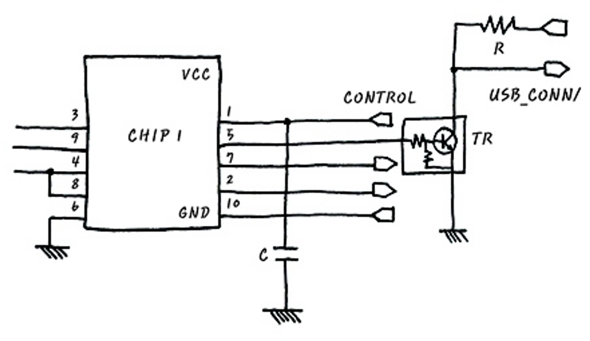

## Hardware 꼴라쥬(Collage)

기본적으로 Hardware라는 것은 물리적인 현상을 활용하여 원하는대로 동작하도록 만든 전기장치를 의미한다.

꼴라쥬라는 것은 여러 가지 잡동사니를 혼합하여 표현한 것을 활용을 통해 새로운 형태로 재창조해 낸 것을 의미하는 미술용어이다. 이와 같이 Hardware를 잘 이해하고 설계, 조작하기 위해서 다양한 HW를 알아야 하는 것은 당연하다.

이를 위해 선행되는 지식이 필요한데, 아래와 같다.

- HW level의 신호 파악
- 필요한 신호와 그렇지 않은 신호 필터링
- HW 구성을 위한 다양한 구성요소(Register, Clock, Bus, Memory 등의 component) 이해

이들을 모두 알게된다면 지금은 복잡해보이는 아래의 회로도를 해석할 수 있을 것이다. 또한 저항, 인덕터, 캐패시터가 무엇이고 어떤 역할을 하지는도 대답할 수 있을 것이다.

먼저 신호에 대해서 살펴보겠다.

### 후기

1장을 어떻게 진행할 것인지 설명하는 부분인데.. 첫 장 첫 문단이 `ㅋ`으로 끝날줄은 전혀 예상하지 못했다. 당황스럽다. 그래도 1장 끝나면 회로도를 어느정도 읽을 수 있게 된다는 것 같으니 동기부여가 되는 것.. 같다.

- [신호와 주파수 영역 - Spectrum Analysis](./2.md)
