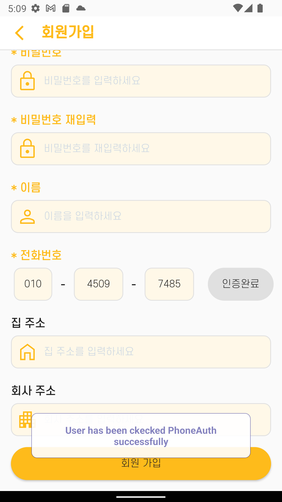
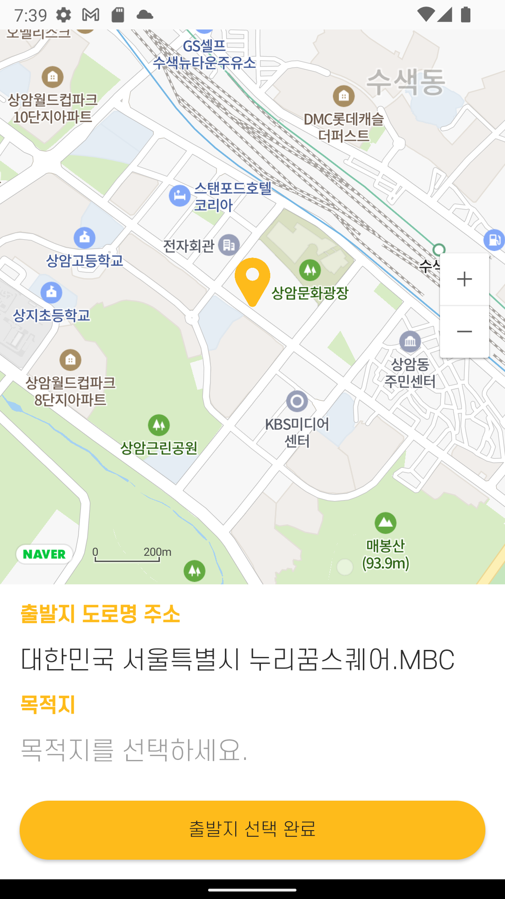
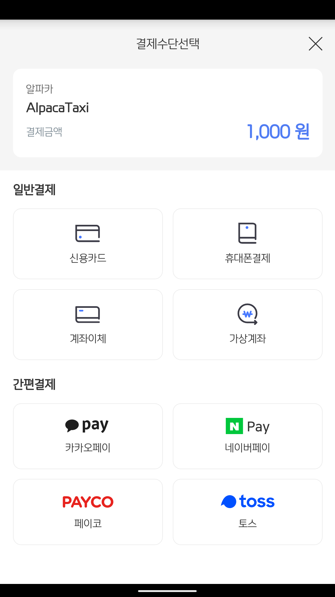

  
   
  

# 🐏 알파카[Alpaca] - Mobile

- 서비스명 : 알파카 [Alpaca]

- 개발기간 : 2022.08.29 ~ 2022.10.07 (6주)

- 팀명 : 화성 갈끄니까🚀    

  

# 🌈 서비스 소개

## 1. 알파카[Alpaca] 이란?

- 운전에 대한 부담을 없애고 대신 다른 활동을 할 수 있도록 보장해주는 "자율주행 무인 택시 서비스"
  
## 2. 서비스 기획 배경
  
  

    
    
  

- 편리한 이동수단 중 하나일 자동차는 신호를 지켜야하고, 차선을 유지해야하며, 갑작스레 튀어나오는 사람 등을 조심해야하기때문에 운전을 잘 하기란 어려움.

- 센서에 의한 자율주행 시스템을 도입하여 대처하기 어려운 상황을 피하고, 나아가 운전자 없는 운전이 가능하도록 하는 것이 목표

    

# 👶 주요 기능

## 🎅 회원 관리

> + ### 이메일/비밀번호, 전화, SNS (Google, Facebook, Github)
> + ### 회원가입, 제공자 등록, 로그인, 마이페이지, 회원정보 수정, 비밀번호 변경, 회원탈퇴
> + ### Firebase Authentication(인증), Firestore Database(DB 관리), Stoage(사진 저장) 사용

 

## 1. 회원가입
   - 프로필사진, 이메일 아이디, 비밀번호, 이름, 전화번호, 집 주소, 회사 주소 입력
   - 전화번호 인증 기능 제공
   - 주소 API를 사용한 간편 등록 가능

   
   
   <h3>[일반 / SNS 로그인 회원가입]</h3>

 

 

   
   
   
   
   <h3>[전화번호 인증]</h3>

 

## 2. 제공자 등록
   - 차량 사진, 차량 이름, 차량 번호 입력
   - 유저 홈 페이지에서 제공자 홈 페이지로 이동 시 정보가 없다면 출력

   
   <h3>[제공자 등록]</h3>

 

## 3. 로그인
   - 일반 로그인 기능 제공
   - SNS 로그인(Github, Facebook, Google) 기능 제공 및 프로필 받아오기

   
   
   <h3>[일반 / SNS 로그인]</h3>

 

## 4. 마이페이지
   - 회원 정보 조회, 즐겨찾기 수정, 회원정보 수정, 비밀번호 변경, 로그아웃, 회원탈퇴, 탑승했던 택시 정보, 챗봇 기능 제공

   
   
   <h3>[마이페이지]</h3>

 

## 5. 회원정보 수정
   - 프로필사진, 전화번호, 집 주소, 회사 주소 수정
   - 전화번호 인증 기능 제공
   - 주소 API를 사용한 간편 등록 가능

   
   <h3>[회원정보 수정]</h3>

 

## 6. 비밀번호 찾기
   - 가입된 Email로 비밀번호 변경 메일 전송
   - 기존 비밀번호 재확인(ReAuth) 후 비밀번호 변경

   
   

 

   
   
   
   <h3>[Email로 비밀번호 변경]</h3>

 

   
   
   <h3>[비밀번호 변경]</h3>

 

## 7. 회원탈퇴
   - 사용자의 실수를 방지하기 위한 Switch, Dialog 창을 통한 이중 확인
   - 회원탈퇴 시 관련된 정보 모두 삭제 (단, 알파카 이용 내용은 상대가 조회 가능.)

   
   
   <h3>[회원탈퇴]</h3>

  

## ⭐ 즐겨찾기
> + ### 주소 API 적용 (주소, 위/경도 함께 등록)
> + ### Firestore Database 사용

 

   
   
   
   <h3>[즐겨찾기 등록]</h3>

 

   
   
   <h3>[즐겨찾기 삭제]</h3>

  

## 🏠 유저 / 제공자 화면
> + ### 유저 홈, 제공자 홈, 제공자 차량 이용자 상세 내용
> + ### 특정조건을 달성하면 등급 획득 가능 (Unrank, Bronze, Silver, Gold 등)
> + ### Firestore Database 사용

 

## 1. 유저
   - 유저 정보, 즐겨찾기, 자주가는 목적지 출력

   
   <h3>[유저 홈]</h3>

 

   - 택시 번호, 탑승 평점 출력

   
   <h3>[이용 택시 리스트]</h3>

 

   - 택시 번호, 탑승 평점, 출발/목적지, 소요 시간, 운행 거리, 요금 출력, 1:1 채팅 기능 제공

   
   <h3>[이용 택시 상세 내용]</h3>

 

## 2. 제공자
   - 회원 정보 출력, 수익 금액, 차량 번호, 평점, 운행여부, 마감시간, 이용자 정보 조회

   
   
   <h3>[제공자 홈]</h3>

 

   - 출발 전/후 차량 내부 사진, 승차감 평점 조회, 1:1 채팅 기능 제공

   
   
   <h3>[제공자 차량 이용자 상세 내용]</h3>

  

## 🚕 무인 택시 이용
> + ### 출발지/목적지 설정, 택시 호출, 택시 출발, 택시 도착 및 평점, 택시 탑승 전/후 점검
> + ### Naver Map API와 Kakao 지도 API를 활용해 택시 위치와 경로를 기반으로 커스텀마커, 폴리라인 식별
> + ### 경로에 따라 남은시간, 금액 식별
> + ### 탑승 전/후 평점 시스템
> + ### Firestore Database, Storage 사용

 

## 1. 출발지/목적지 설정

   
   <h3>[출발지/목적지 설정]</h3>

 

## 2. 택시 호출
   - 출발지 -> 목적지 간 경로 받아옴
   - 택시 호출 후 탑승 평점 출력

   
   
   
   <h3>[택시 호출]</h3>

 

## 3. 택시 출발
   - 사용자에게 도착 후 문열림, 탑승 전 전검 기능 제공

   
   <h3>[택시 출발]</h3>

 

## 4. 택시 도착 및 평점
   - 탑승 후 평점 및 점검 기능 제공

   
   <h3>[택시 도착 및 평점]</h3>

 

## 5. 택시 탑승 전/후 점검
   - 탐승 전/후 사진을 통한 점검 (블랙 컨슈머 방지)

   
   <h3>[택시 탑승 전/후 점검]</h3>

  

## 💰 결제

> + ### Boot Pay API 사용

 

   
   
   
   
   <h3>[Boot Pay]</h3>

  

## 💭 1:1 채팅 / 챗봇

> + ### 1:1채팅, 챗봇
> + ### Realtime Database, Firestore Database 사용

 

## 1. 1:1 채팅
   - 사용자의 고유 아이디를 통해 채팅

   
   
   <h3>[1:1 채팅]</h3>

 

## 2. 챗봇
   - 챗봇을 이용해 사용자에게 알파카에 대한 시스템 안내 및 고객센터 기능 제공

   
   
   <h3>[챗봇]</h3>

  

# 🐏 '알파카'를 이용하면 일어나는 기대효과!

 - 장점
    - 자동차 제공자가 스스로 소소하게 돈을 벌어올 수 있도록 한다.
    - 야간할증이 사라지고 기본 승차 요금이 싼 가격에 택시를 이용할 수 있다.
    - 승차 거부가 없다.
 - 단점
    - 미래가 되어도 자율주행차에 대한 법적, 사회적 인식이 부족할 것이다.
    - 블랙 컨슈머에 대한 저지력이 약하다.

  

# 🏃 향후 계획

1. **알파카**는 근처 주차장에 자동으로 주차를 진행한다.
2. **알파카**는 차량 제공자가 설정해놓은 지역을 벗어나는 목적지를 원하는 손님과 매칭되지 않는다.
3. **ROS**를 **ROS2**로 바꾸어 성능을 향상시킨다.

  

# 💻 기술 스택

   

 

> + ### Mobile : **Android, Kotlin, MVVM 디자인 패턴, Hilt 라이브러리**
> + ### API : Naver Map API, Kakao 주소 API, BootPay 결제 API
> + ### Database : **Firebase** (Auth, Reatime Database, Firestore Database, Storage)
> + ### 기획 : Notion, Kakao Oven, **Figma**
> + ### 협업 : **GitLab, Jira**, Matter Most, Webex

  

# 👨‍👩‍👧‍👦 팀원 역할

| 팀원 | 직무 | 주요 업무 | 한 줄 소감  |
| - | - | - | - |
| 공통 | - |- 기획 : Notion, UI/UX(Kakao Oven/**Figma**), DB설계, 기능명세서 - 협업 : 코드 컨벤션 구성, 데일리 스크럼, **GitLab, JIRA**, 간트 차트 - **기술 : Android(MVVM/Hilt), Kotlin, Firebase**, nav_graph 설계| -  |
| **김기한 😎** | **Mobile (Android)** | **- 주요 담당 페이지 : 유저/제공자 메인화면, 출발/목적지 설정, 자주가는 출발/목적지, 택시 운행 페이지, 즐겨찾기, 차량 평가** - 기술 : 프로젝트 기본 틀 구성, ROS-Firebase-Android 데이터 통신, Naver Map API, Kakao 주소 API, apk 추출 - 기타 : PPT 자료 구성, 라이브 시연, 포팅메뉴얼 | - |
| **박한훈 😆** |  **Mobile (Android)**  | **- 주요 담당 페이지 : 회원 관리(문자/SNS), 마이페이지, 회원정보 출력, 결제, 탑승택시 목록, 즐겨찾기, 차량 평가, 1;1 채팅, 챗봇** - 기술: BootPay API, 이미지 업로드, 기능별 자료 추출 - 기타 : PPT 자료 구성 및 발표, UCC 촬영, ReadMe 작성, 포팅메뉴얼| - |

  

# 📚 산출물

### **[Notion]** https://www.notion.so/d210/SSAFY-8d8771c733e7469e93c6bc9bb7c9efa3

### **[Figma]** https://www.figma.com/file/C5uWGbOfh5Fdb5Ecd1zj3w/D208?node-id=0%3A1

### **[컨벤션]** https://www.notion.so/408481488bb34fad90b9ab159e8373b2

### **[기능 명세서]** https://www.notion.so/78d6380f37cd4fcb8d943a02b57b3ef6?v=c1024d82abee4b1486319567e5e0437e

### **[Firebase 데이터 구조]** https://www.notion.so/Firebase-fe8d7f252983471fa742af2cc0661f51

### **[간트차트]** https://www.notion.so/e78c9d5e71f94366815f6a274dc1eee2?v=8baff8862fe64ca2ada74a82824e5c51

### **[UCC]** Git Lab 내 exec 폴더 참조

### **[포팅 메뉴얼]** Git Lab 내 exec 폴더 참조

# 
